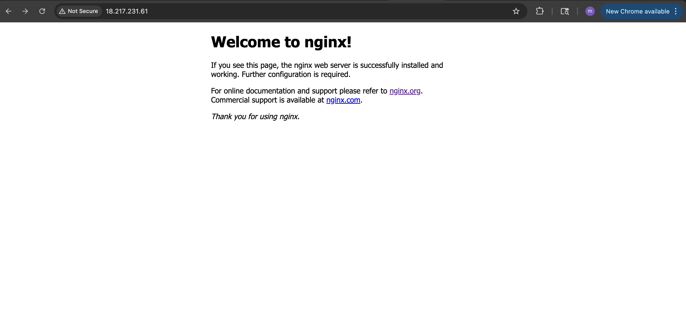

## 🚀 Terraform EC2 Project with NGINX
This project provisions an AWS EC2 instance using Terraform and installs NGINX to demonstrate infrastructure automation skills.

## 🌐 Project Summary
1. Deploys a t2.micro EC2 instance in the us-east-2 (Ohio) region
2. Uses Amazon Linux 2 AMI (ami-0c55b159cbfafe1f0)
3. Opens port 22 (SSH) and 80 (HTTP) via security groups
4. Allows SSH access using a user-generated .pem key
5. Installs NGINX manually after SSH login for demonstration

## ⚙️ Technologies Used
1. Terraform (Infrastructure as Code)
2. AWS EC2
3. Amazon Linux 2
4. NGINX
5. SSH / Key Pairs
6. MacOS & VS Code Terminal

## 🚀 How to Deploy

- Clone this repo:
git clone https://github.com/your-username/terraform-ec2-nginx.git
cd terraform-ec2-nginx

- Initialize Terraform:
terraform init

- Apply Terraform:
terraform apply

- SSH into the instance:
ssh -i ~/.ssh/project-1-key.pem ubuntu@<your-ec2-public-ip>

## 🔧 Install NGINX on EC2 (Manual Step)
- Once inside the instance, run:
sudo apt update
sudo apt install nginx -y

- Then open a browser and go to:
http://<your-ec2-public-ip>

You should see the default NGINX Welcome Page.

- ✅ Example Terraform Output
Apply complete! Resources: 1 added, 0 changed, 0 destroyed.

## 📁 Project Structure
terraform-ec2-nginx/
├── main.tf
├── README.md
├── .gitignore
└── screenshots/
    └── nginx-home.png

🧠 Key Concepts Demonstrated
- EC2 provisioning using Terraform
- Security group setup (SSH + HTTP access)
- Key pair authentication for secure remote login
- Manual provisioning of services (NGINX)
- Use of .tf as repeatable, scalable infrastructure code

## 💸 Cost
This project uses the AWS Free Tier (t2.micro), so it incurs no cost if your account is eligible.

## Screenshot

